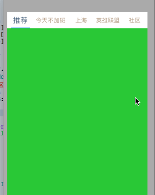
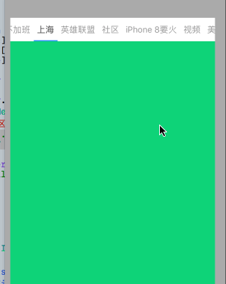

# SXTopMenu
easy create topBar like 今日头条
## 效果


## 1.import
if use Pod 
```
  #import <SXTopMenu.h>
```
else
```
  #import "SXTopMenu.h"
```
## 2.use

```
//use example
SXTopMenuView *view = [[SXTopMenuView alloc] initWithFrame:CGRectMake(0, 20, 375, 647) titles:@[@"推荐", @"今天不加班", @"上海", @"英雄联盟", @"社区", @"iPhone 8要火", @"视频", @"美剧", @"其他"]];
/*
可不设置
    [view setTitleCurrentColorR:.3 G:.4 B:.5];
    [view setTitleNomalColorR:.7 G:.6 B:.5];
    view.currentFont = 20;
    view.layoutDistance = 80;
  */  
  //设置下边view
  [view setViewArr:@[]];
    [self.view addSubview:view];
...
```
## 3.interface
```
@property (nonatomic, assign) CGFloat topHeight;
@property (nonatomic, assign) CGFloat layoutDistance;
@property (nonatomic, assign) CGFloat titleDistance;
@property (nonatomic, strong) UIColor *topBackColor;


@property (nonatomic, assign) double amimateDuration;

@property (nonatomic, assign) CGFloat currentFont;
@property (nonatomic, assign) CGFloat nomalFont;

@property (nonatomic, strong) UIColor *singleLineColor;

@property (nonatomic, strong) NSArray *titleArr;

- (void)setTitleCurrentColorR:(CGFloat)r G:(CGFloat)g B:(CGFloat)b;
- (void)setTitleNomalColorR:(CGFloat)r G:(CGFloat)g B:(CGFloat)b;

#pragma mark - 初始化 必须

/**
 初始化方法

 @param titles 设置顶部title的数组,字符串类型
 */
- (instancetype)initWithFrame:(CGRect)frame titles:(NSArray <NSString *>*)titles;

/**
 设置下边的view数组, 加载会设置frame (hight <- view.height-topHeight)
 
 不设置会生成占位随机色view
 */
@property (nonatomic, strong) NSArray <UIView *>*viewArr;

```

如果有改进建议和问题欢迎留言
